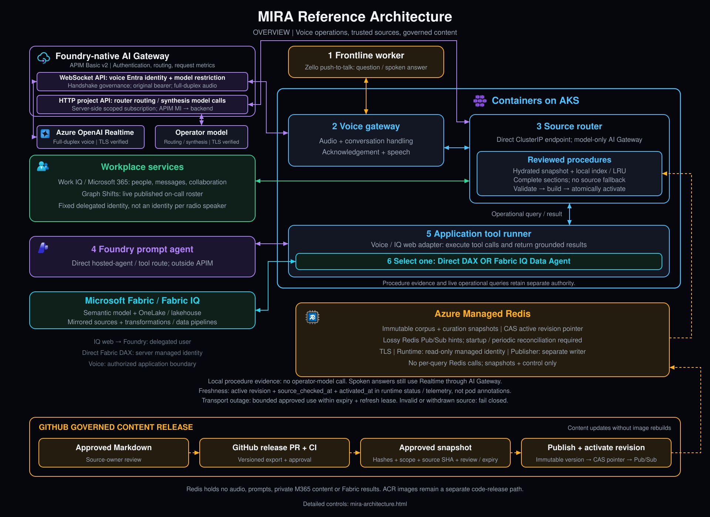
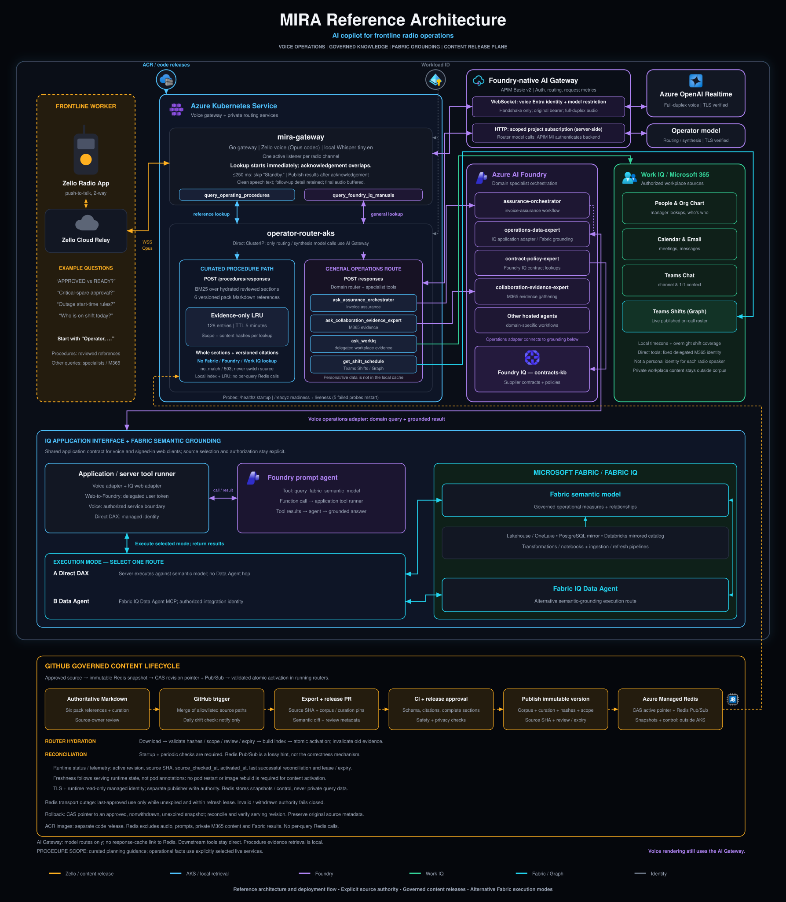
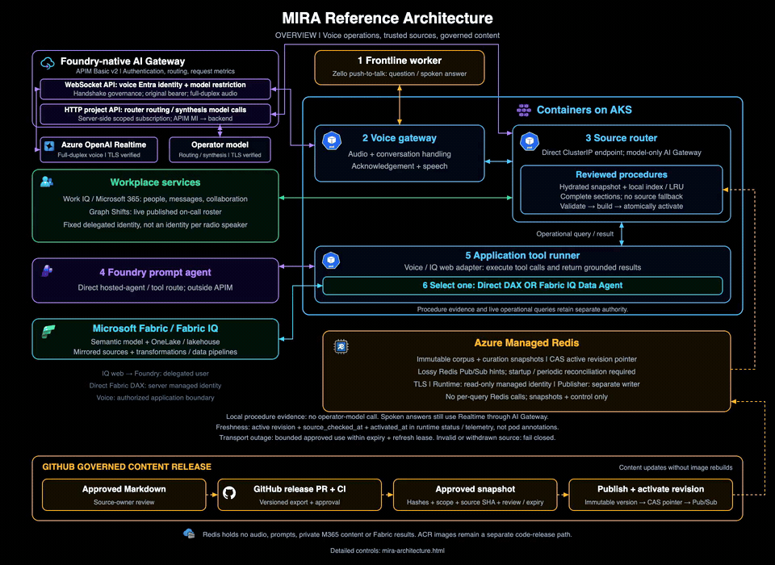
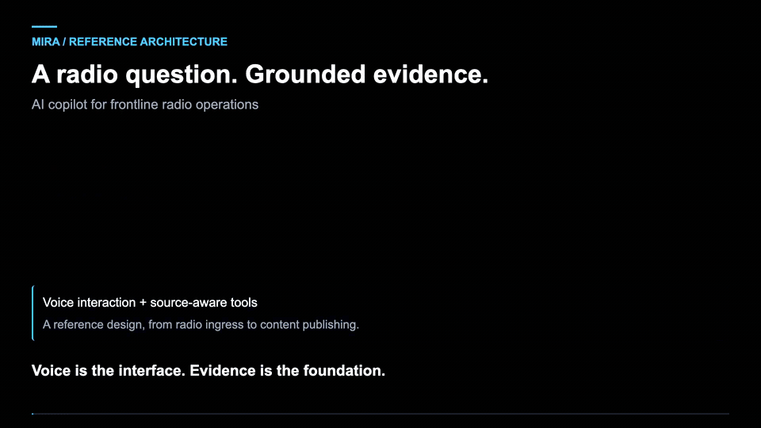
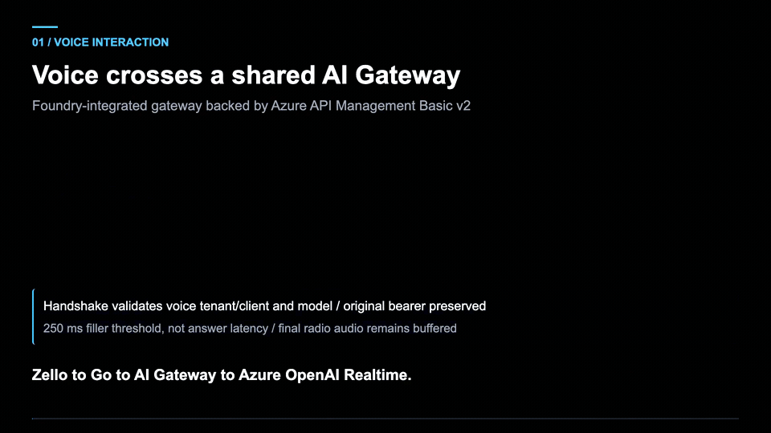
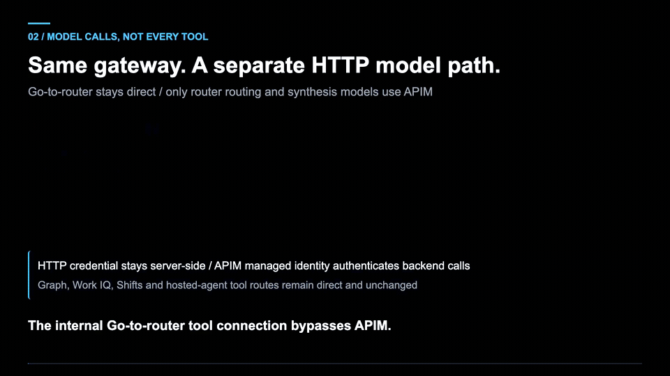
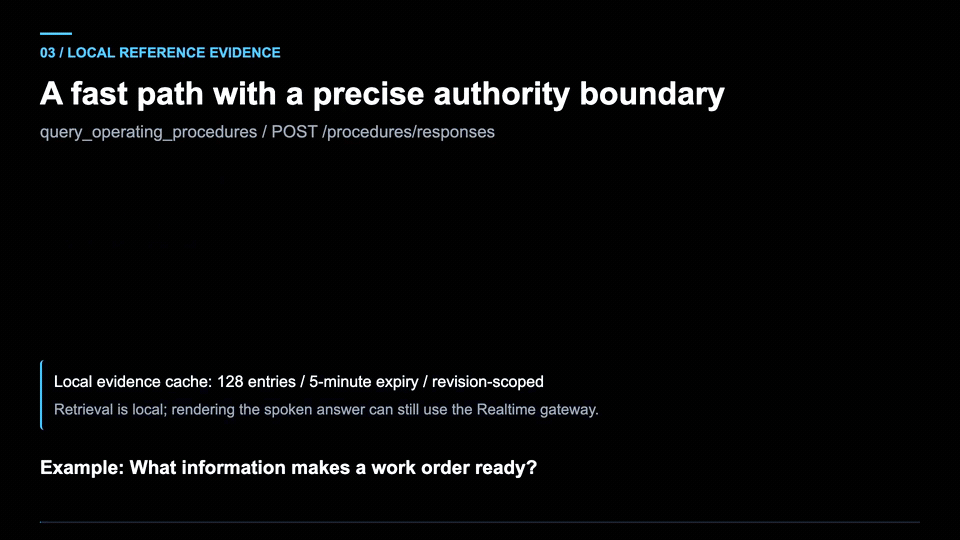
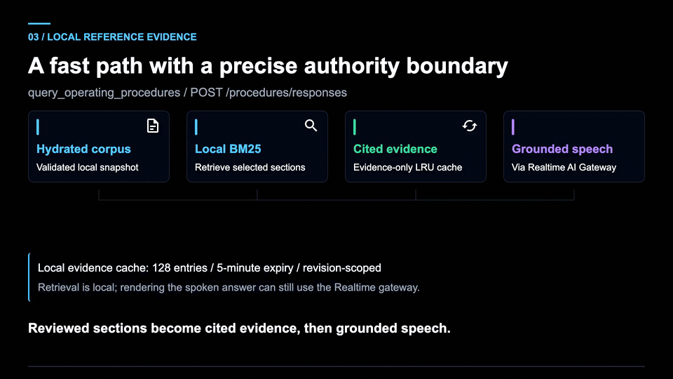
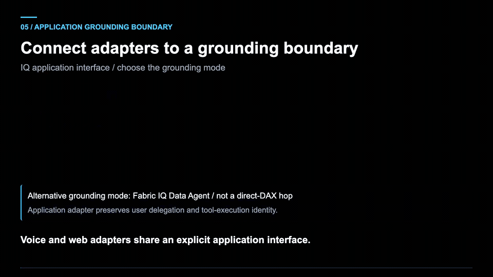
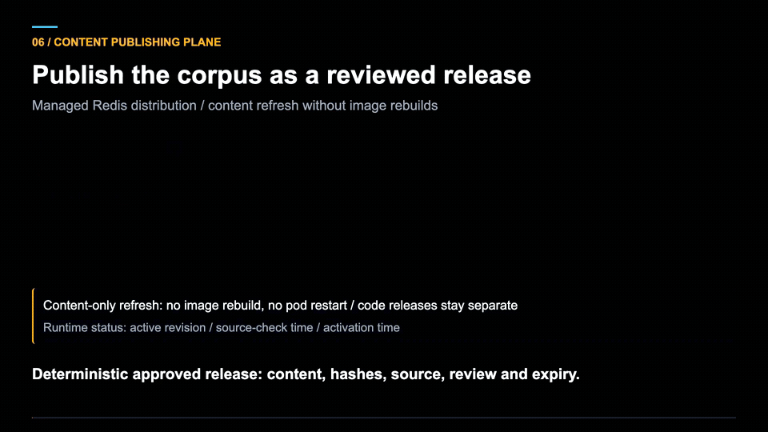

# Mira

**AI copilot for frontline radio operations.** Mira lets a worker ask an
operational question over an ordinary push-to-talk radio and get a spoken,
grounded answer back — hands-free, no app, no screen.

Start with **“Operator, …”** or **“Dispatcher, …”**. Mira handles the voice
conversation, routes the question to an appropriate source, and returns a concise
spoken answer. Reviewed procedures and live operational evidence keep separate
source and authorization boundaries.

[Architecture](#architecture) · [Animated walkthroughs](#animated-walkthroughs) ·
[Repository layout](#repository-layout) · [Getting started](#getting-started)

## Architecture

[Full-size overview](docs/diagrams/mira-architecture-overview.png) ·
[Overview SVG](docs/diagrams/mira-architecture-overview.svg) ·
[Detailed architecture](docs/diagrams/mira-architecture.png)

> **Reference visuals versus current deployment:** these diagrams and animations
> illustrate the earlier shared-APIM gateway design. As of September 15, 2026,
> Realtime voice/WebSockets use the existing BasicV2 APIM, while router HTTP model
> calls, including streaming responses, use the new AIGateway tier. Specialist
> tools, workplace services and Fabric integrations keep their direct routes;
> they do not all pass through the model gateway.

The architecture separates three responsibilities:

1. **Voice interaction:** the Go gateway connects Zello to Azure OpenAI Realtime,
   manages the conversation, and delegates operational lookups.
2. **Grounded answers:** the Python router uses reviewed local procedure evidence
   or explicit specialist and live-data tools, depending on the question.
3. **Governed content:** reviewed, versioned snapshots are validated and activated
   independently of application image releases.

<strong>Detailed architecture and control boundaries</strong>

The detailed view shows procedure retrieval, specialist routing, workplace
identity, alternative Fabric execution modes, and the governed content lifecycle.

[Full-size PNG](docs/diagrams/mira-architecture.png) ·
[Scalable SVG](docs/diagrams/mira-architecture.svg)

## Animated walkthroughs

Open a topic to view its animation. For a nonanimated view, use the diagrams
above. The gateway deployment note applies to these reference animations too.

<strong>1. End-to-end overview</strong> — from radio question to grounded answer

Follow the voice, source-routing and governed-content paths across the system.

[Download the overview video (MP4)](docs/diagrams/mira-architecture-overview-animated.mp4)

<strong>2. Reference architecture</strong> — the components and their boundaries

See how the voice gateway, router, model backends, specialist tools and content
release plane fit together.

<strong>3. Voice flow</strong> — Zello and Azure OpenAI Realtime

Trace the voice path through the gateway to the separate Realtime model backend
and back to the worker.

<strong>4. Model gateway</strong> — model traffic versus direct tool calls

This scene illustrates the original shared-APIM routing. In the current split,
the new AI Gateway handles HTTP model inference; the existing APIM retains voice
WebSockets. Downstream tool calls remain separate.

<strong>5. Fast procedures</strong> — reviewed evidence without a live-source fallback

Procedure lookups use a hydrated, reviewed snapshot and local index. Retrieving
that evidence does not require a router-model call; speaking the answer still
uses Realtime.

<strong>6. Evidence loop</strong> — tool request, execution and grounded result

Follow a tool call through application execution and the return of evidence to
the answering agent.

<strong>7. Fabric boundary</strong> — select an explicit grounding route

The reference design distinguishes direct DAX execution from a Fabric IQ Data
Agent route. They are alternative execution modes, not an automatic fallback
chain.

<strong>8. Content release</strong> — reviewed content without rebuilding application images

Follow source review, immutable snapshot publication, active-revision selection
and validated activation. Redis distributes snapshots and control information,
not private conversation data.

## Repository layout

Three co-developed components are versioned together as one reference
architecture:

| Path | What it is | Language |
|---|---|---|
| [`services/mira-gateway/`](services/mira-gateway/) | Zello push-to-talk radio gateway. Handles wake-word detection, Azure OpenAI Realtime conversation sessions, and routes tool calls to the operator agent. | Go |
| [`services/operator-agent/`](services/operator-agent/) | Python operator agent and AKS router, with reviewed procedure retrieval and specialist tools for grounded operational answers. Includes Foundry-hosted and self-hosted variants; see the [agent architecture](services/operator-agent/docs/architecture.md) for component details. | Python |
| [`ontology-governance/`](ontology-governance/) | Governance pipeline: Fabric's Git integration syncs the Ontology item here, GitHub Actions transforms it and publishes it to Azure Managed Redis via Entra ID (no access keys, no stored secrets). This keeps ontology schema changes PR-reviewable instead of silent. | Python (scripts) + GitHub Actions |

## Why one repo

`mira-gateway` and `operator-agent` change together constantly — a routing
change on one side usually needs a matching tool-schema change on the other.
Keeping them in one repo means those changes land in a single, atomic PR
instead of being coordinated across separate repos.

`ontology-governance` is included here as the current reference example of
the governance pattern, but note that in a real multi-customer deployment
each customer would have **their own** ontology-governance content (their
own Fabric workspace, their own curated enrichment) while reusing the same
`mira-gateway` + `operator-agent` code unchanged.

## Getting started

Each subfolder is self-contained with its own dependencies, Dockerfile, and
(where applicable) Kubernetes manifests:

- `services/mira-gateway/` — see its own README for build/run instructions,
  including how to produce the local `bin/mira` binary (both the plain
  Go-only build used for unit tests, and the full native build with
  Opus/Whisper support for actually running it).
- `services/operator-agent/` — see `docs/architecture.md` for how grounding
  works, and `docs/slides/` for a technical demo deck and a partner
  go-to-market deck.
- `ontology-governance/` — see its own README for how to connect a Fabric
  workspace's Git integration and how the GitHub Actions publish pipeline
  works.

## Infrastructure

[`docs/INFRASTRUCTURE.md`](docs/INFRASTRUCTURE.md) is a full as-built
snapshot of every Azure resource, identity, RBAC role, and Kubernetes
object behind a live deployment of this system — captured directly from
Azure/`kubectl`, with `az` commands to recreate each piece in a fresh
subscription. Start there if you're standing this up from scratch.

[`docs/REBUILD_PLAYBOOK.md`](docs/REBUILD_PLAYBOOK.md) is written
specifically for an AI coding agent (Copilot, Microsoft Scout, etc.) to
follow step-by-step when asked to rebuild this infrastructure — it says
what to ask the user for first, the exact order to create things in, and
where to pause for the handful of steps that are portal-only (Fabric
workspace access, Zello account setup) and can't be automated.

## History note

This repo was formed by merging three prior repositories
(`dcasati/mira`, `dcasati/mira-operator-agent`,
`dcasati/operator-matrix-ontology`) via `git subtree`, preserving each
one's full commit history under its new path.
