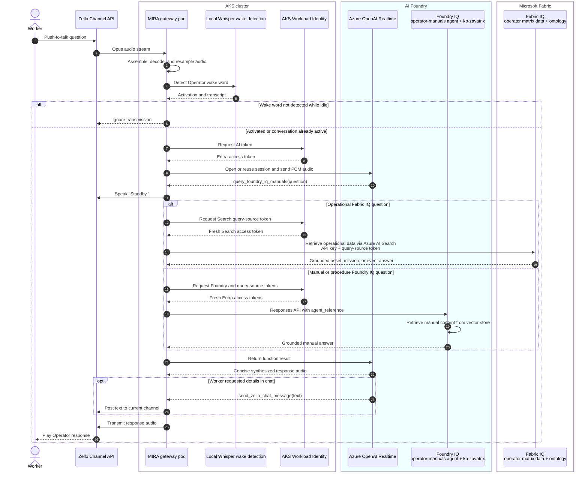

# Foundry IQ manuals POC

MIRA uses Azure OpenAI Realtime for the live Zello conversation and calls a separate Foundry IQ tool when Operator needs grounded manual or procedure answers.

## Solution sequence



The operational path calls the Azure AI Search knowledge-base retrieve endpoint directly so it can supply fresh query-source authorization. The manual path uses the published `operator-manuals` Foundry agent and its attached `kb-zavatrix` knowledge base.

## Created resources

| Resource | Value |
|---|---|
| Foundry project endpoint | `https://admin-2434-resource.services.ai.azure.com/api/projects/admin-2434` |
| Model deployment | `gpt-5-mini` |
| Embedding deployment | `text-embedding-3-small` |
| Foundry IQ knowledge base | `kb-zavatrix` |
| Vector store | `operator-manuals-store` (`vs_1uulh0J0Z3SliCOhLM8W9DN7`) |
| Foundry IQ agent | `operator-manuals` |
| Uploaded POC document | Sanitized `operator-poc-manual.md` generated from `FieldNotes.md` |

The sanitized upload excludes the credential/login section from `FieldNotes.md`.

`operator-manuals` now has `kb-zavatrix` attached in the Foundry portal. The runtime log still shows MIRA's local Realtime tool name, `query_foundry_iq_manuals`; that tool invokes the `operator-manuals` Foundry agent, and the agent retrieves from `kb-zavatrix`.

## Runtime configuration

`k8s/configmap.yaml` enables two retrieval paths:

1. Manual/document questions go through the Foundry `operator-manuals` agent.
2. Operational Fabric IQ questions bypass `agent_reference` and call the dedicated Azure AI Search knowledge-base retrieve endpoint directly.

```yaml
FOUNDRY_PROJECT_ENDPOINT: "https://admin-2434-resource.services.ai.azure.com/api/projects/admin-2434"
FOUNDRY_IQ_AGENT_NAME: "operator-manuals"
FOUNDRY_IQ_MODEL: "gpt-5-mini"
FOUNDRY_IQ_MAX_OUTPUT_CHARS: "6000"
MIRA_LOOKUP_FILLER: "Standby."
FOUNDRY_IQ_SEARCH_ENDPOINT: "https://search-openai-demo.search.windows.net"
FOUNDRY_IQ_FABRIC_KB: "ks-fabriciq-operator-matrix"
```

`mira-foundry` Kubernetes secret provides the Search API key:

```text
FOUNDRY_IQ_SEARCH_API_KEY=<search-openai-demo admin/query key>
```

`FOUNDRY_IQ_QUERY_SOURCE_TOKEN` must not be set.

## Fabric IQ authentication and authorization

### What works

For operational questions such as ASSET IDs, missions, events, relay hardline, checkpoints, call signs, prowords, or ontology relationships, MIRA calls Azure AI Search retrieve directly:

```http
POST https://search-openai-demo.search.windows.net/knowledgebases('ks-fabriciq-operator-matrix')/retrieve?api-version=2026-05-01-preview
api-key: <FOUNDRY_IQ_SEARCH_API_KEY>
x-ms-query-source-authorization: <fresh token for https://search.azure.com/.default>
```

The Search API key authenticates the application to Azure AI Search. The `x-ms-query-source-authorization` token identifies the querying principal for Fabric IQ query-time ACL/RBAC enforcement. MIRA obtains that token dynamically with AKS Workload Identity / `DefaultAzureCredential`.

### Required permissions

MIRA workload identity:

```text
Name: id-mira-gateway
Client ID: a2efd0d1-4711-4e23-9289-3b683071d608
Principal ID: e207130d-43a7-4d7c-89a5-fb854f14ca3b
```

Required assignments:

| Scope | Role |
|---|---|
| Foundry project `admin-2434` | `Foundry User` |
| Fabric workspace `iq-gbb-workhop` | `Member` |
| Search service `search-openai-demo` | `Search Index Data Reader` |
| Search service `search-openai-demo` | `Search Service Contributor` |

The Search service managed identity must also have access to the embedding/model resource:

| Principal | Scope | Role |
|---|---|---|
| `search-openai-demo` system-assigned managed identity | `admin-2434-resource` | `Cognitive Services User` |

### Do not use a static query-source token

Do not store `FOUNDRY_IQ_QUERY_SOURCE_TOKEN` as a static secret. That token expires and causes Fabric IQ retrieval failures like:

```text
Invalid header 'x-ms-query-source-authorization': TokenExpired
```

The correct runtime configuration is:

```text
FOUNDRY_IQ_QUERY_SOURCE_TOKEN=not_set
FOUNDRY_IQ_SEARCH_API_KEY=set
```

MIRA must mint a fresh `https://search.azure.com/.default` token through workload identity for every Fabric IQ query.

To remove an accidentally stored static token:

```bash
kubectl -n mira patch secret mira-foundry \
  --type=json \
  -p='[{"op":"remove","path":"/data/FOUNDRY_IQ_QUERY_SOURCE_TOKEN"}]'

kubectl -n mira rollout restart deployment/mira-gateway
```

Verify:

```bash
kubectl -n mira exec deploy/mira-gateway -- /bin/sh -c '
  if [ -n "$FOUNDRY_IQ_QUERY_SOURCE_TOKEN" ]; then
    echo FOUNDRY_IQ_QUERY_SOURCE_TOKEN=set
  else
    echo FOUNDRY_IQ_QUERY_SOURCE_TOKEN=not_set
  fi
  echo FOUNDRY_IQ_SEARCH_API_KEY=${FOUNDRY_IQ_SEARCH_API_KEY:+set}
  echo FOUNDRY_IQ_FABRIC_KB=$FOUNDRY_IQ_FABRIC_KB
'
```

Expected:

```text
FOUNDRY_IQ_QUERY_SOURCE_TOKEN=not_set
FOUNDRY_IQ_SEARCH_API_KEY=set
FOUNDRY_IQ_FABRIC_KB=ks-fabriciq-operator-matrix
```

## Uploading more manuals

Use Azure AI Foundry portal to add files to `kb-zavatrix`:

1. Open the `admin-2434` project.
2. Go to **Knowledge**.
3. Open knowledge base `kb-zavatrix`.
4. Upload the manual files.
5. Wait until ingestion completes.
6. Open **Agents** > `operator-manuals`.
7. Confirm `kb-zavatrix` is listed under **Knowledge**.
8. Click **Publish** so runtime callers use the updated agent version.
9. Test in the portal chat with a question that only the uploaded manual can answer.

Do not upload unsanitized field notes or files containing passwords, tokens, private keys, or other access material.

## Embedding model and managed identity

`kb-zavatrix` uses Azure AI Search resource `search-openai-demo` and embedding deployment `text-embedding-3-small`.

The Search service must have a system-assigned managed identity and that identity must have **Cognitive Services User** on the Foundry/Azure AI resource that hosts the embedding deployment:

```bash
az search service update \
  -g rg-openai-demo \
  -n search-openai-demo \
  --identity-type SystemAssigned

SEARCH_MI=$(az search service show \
  -g rg-openai-demo \
  -n search-openai-demo \
  --query identity.principalId -o tsv)

az role assignment create \
  --assignee-object-id "$SEARCH_MI" \
  --assignee-principal-type ServicePrincipal \
  --role "Cognitive Services User" \
  --scope /subscriptions/6edaa0d4-86e4-431f-a3e2-d027a34f03c9/resourceGroups/1-rg-chaos-demo/providers/Microsoft.CognitiveServices/accounts/admin-2434-resource
```

If file upload fails with an embedding `404`, verify:

1. The knowledge base selected embedding model `text-embedding-3-small`.
2. The deployment exists on `admin-2434-resource`.
3. `search-openai-demo` has managed identity enabled.
4. The Search identity has **Cognitive Services User** on `admin-2434-resource`.
5. RBAC has had a few minutes to propagate, then retry the upload.

## Worker prompts

Examples:

```text
Operator, what does the manual say about the 2 meter VARA FM frequencies?
Operator, look up the radio setup procedure.
Operator, what steps are documented for VARA FM?
Operator, look up the radio setup procedure and send it in chat.
```

Operator should call `query_foundry_iq_manuals` before answering manual, procedure, maintenance, troubleshooting, error-code, or documented-spec questions.

When Operator decides to use Foundry IQ, it first says the configured filler phrase (`Standby.` by default), then runs the lookup and speaks a concise grounded answer.

If the worker explicitly asks to send instructions in chat, Operator can call `send_zello_chat_message`. That posts concise text to the current Zello channel using the same Zello account.

## Fabric IQ Matrix-style data package

A separate synthetic Fabric IQ package was created at:

```text
mira/fabric-iq-matrix-poc/
```

It includes structured CSV files, a JSON ontology, a Turtle ontology, and Fabric data agent instructions. The package is also zipped at:

```text
mira/fabric-iq-matrix-poc/operator-fabric-iq-matrix-poc.zip
```

The currently visible Fabric workspaces returned `FeatureNotAvailable` for Lakehouse creation through the Fabric REST API. To use the package in Fabric IQ:

That was resolved by creating an F2 Fabric capacity and assigning the IQ workshop workspace to it:

| Fabric item | Value |
|---|---|
| Capacity | `operatorfabricpoc` |
| Capacity SKU | `F2` |
| Capacity ID | `f7a57af9-0be9-4004-9f26-ef06d3c180d8` |
| Workspace | `iq-gbb-workhop` |
| Workspace ID | `71f18f4c-2832-4dbc-9fdf-178b0954cc38` |
| Lakehouse | `operator_matrix_poc` |
| Lakehouse ID | `a1d81601-1fde-43d7-98c7-8d62c077ba57` |
| SQL endpoint ID | `666986a2-6c81-4bd8-9793-0178d1d7ea5e` |

Uploaded OneLake paths:

```text
Files/operator_matrix_poc/
Tables/operator_mission_manual
Tables/simulation_assets
Tables/operator_events
Tables/call_signs
Tables/missions
Tables/mission_events
Tables/original_roles
```

Next steps:

1. Open workspace `iq-gbb-workhop`.
2. Open Lakehouse `operator_matrix_poc`.
3. Confirm the four Delta tables are visible.
4. Add `operator_ontology.json` or `operator_ontology.ttl` as ontology/context.
5. Create a Fabric data agent over those sources.
6. Connect the Foundry `operator-manuals` agent to that Fabric data agent/Fabric IQ source.

Native Fabric ontology item:

```text
operator_matrix_ontology
Ontology ID: 3a91904a-addb-4847-b47b-32aef40e0e3f
```

The native Ontology item currently needs manual entity-type entry in the portal. The public Fabric item `updateDefinition` API accepted the request but reset `definition.json` to `{}`, and entity-type REST routes are not exposed. Use:

```text
mira/fabric-iq-matrix-poc/ontology/manual-entry.md
```

## Fabric IQ auth limitation in Foundry agent references

Foundry IQ sources that enforce query-time ACL/RBAC require `x-ms-query-source-authorization`. Foundry Agent Service MCP tools invoked through `agent_reference` do not honor per-request MCP headers. Attempting to put the header directly in the persisted MCP tool definition is rejected because sensitive headers are blocked.

Result:

```text
Invalid header: 'x-ms-query-source-authorization' is invalid, null or empty
```

The same Fabric IQ query works in the Foundry playground under the signed-in user because the playground supplies user context. For this POC, MIRA bypasses the `agent_reference` MCP header limitation for operational questions by calling the dedicated Fabric IQ knowledge base (`ks-fabriciq-operator-matrix`) directly through Azure AI Search retrieve API. Manual questions still use the `operator-manuals` Foundry agent path.

### Transient Fabric data-agent failures

The Fabric data-agent backend can intermittently return:

```text
status=502
Failed to connect to Fabric Data Agent
```

This means Azure AI Search reached the Fabric IQ knowledge source, but the downstream Fabric data-agent service failed. It is not a Zello issue and not the original missing-token issue.

MIRA treats 502/503/429 and Fabric data-agent backend connection errors as transient and retries with backoff. If all retries fail, MIRA surfaces a concise service-unavailable response instead of returning hardcoded data. Customer implementations should not hardcode Fabric IQ answers; they should either retry, fail cleanly, or use a deterministic SQL/KQL tool for critical operational queries.

## Radio operator behavior

Operator's Realtime prompt uses radio-style procedure:

- Address the caller by Zello name or call sign when known.
- Use prowords naturally: `Roger`, `Wilco`, `Standby`, `Say again`, `Affirmative`, `Negative`, `Correction`, `I say again`, `Over`, `Out`.
- Use `Over` when expecting a reply and `Out` when the exchange is complete.
- Never say `over and out`.
- Understand NATO phonetic alphabet words such as Alpha, Bravo, Charlie, Delta, Echo, Sierra, and Zulu.

Example:

```text
wx-ops, Operator. Roger. Standby while I check the manual. Over.
```
