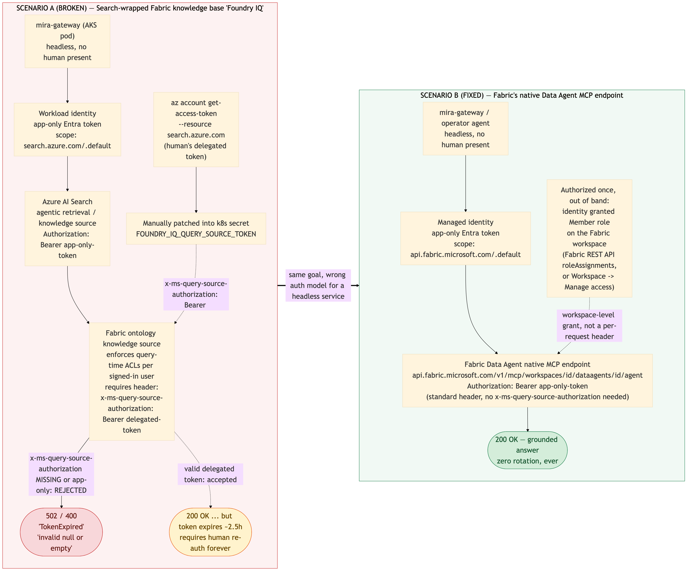
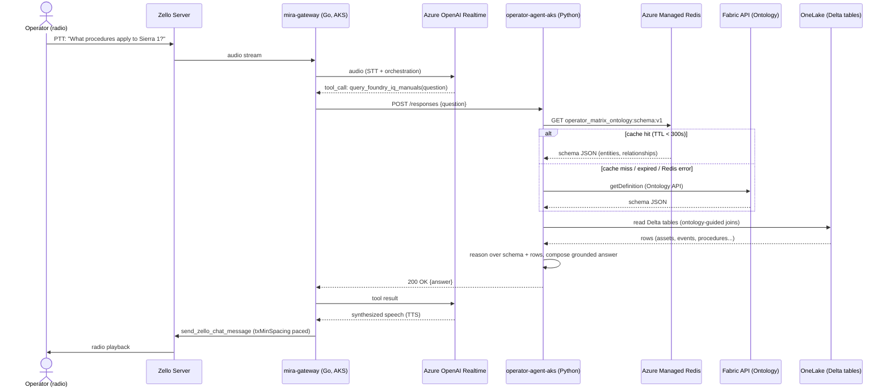
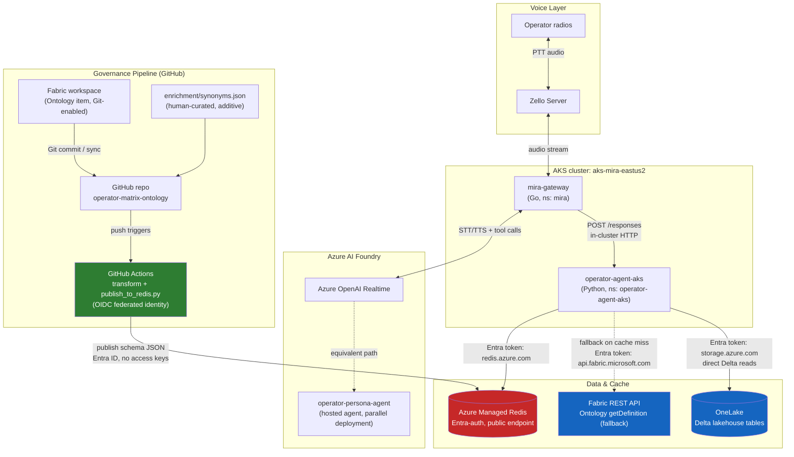

# Architecture

This document describes how `mira-gateway` (Zello radio integration) answers
operator questions by grounding on Fabric's Ontology metadata and reading
operational data directly from OneLake, with Azure Managed Redis as a
governed cache in front of Fabric's ontology discovery step.

## Fabric authorization: two incompatible models, and why one of them broke us

There are two separate ways to ground an agent on Fabric data, with two
fundamentally different authorization requirements. Getting this wrong is
what caused the original production outages this architecture replaced.



**Scenario A (broken): the Azure AI Search–wrapped Fabric knowledge base
("Foundry IQ").** The AI Search agentic-retrieval call itself is
authorized normally with the caller's own app-only token
(`Authorization: Bearer <app-only-token>`, scope `search.azure.com/.default`).
But the underlying Fabric ontology knowledge source additionally enforces
query-time ACLs per signed-in user, and requires a **second, separate
token passed via a custom header**:

```
x-ms-query-source-authorization: Bearer <delegated-user-token>
```

If this header is missing, or contains an app-only token instead of a
genuine delegated (human) token, the request is rejected — with generic
errors (`502`/`400`, `TokenExpired`, "invalid null or empty") that give no
indication the real cause is "wrong token type in this header." The only
way to populate this header for a headless service is to mint a delegated
token out of band (e.g. `az account get-access-token --resource
search.azure.com` under a human's session) and inject it manually — we did
this via a k8s secret (`FOUNDRY_IQ_QUERY_SOURCE_TOKEN`) as a stop-gap. It
works, but that token expires (~2.5h observed) and requires perpetual
human re-authentication — not viable for a production, always-on service.

**Scenario B (fixed): Fabric's own native Data Agent MCP endpoint**
(`api.fabric.microsoft.com/v1/mcp/workspaces/{id}/dataagents/{id}/agent`).
This surface has no equivalent second header — it only needs the standard
`Authorization: Bearer <app-only-token>` header (scope
`api.fabric.microsoft.com/.default`). Authorization happens once, out of
band, by granting the calling identity **Member role on the Fabric
workspace** (via the Fabric REST API's `roleAssignments` endpoint, or
Workspace → Manage access in the portal) — not per-request. After that
grant exists, a standard app-only Entra token (managed identity, no human
involved) works every time — the same pattern used for any other headless
Azure-to-Azure call. This is what `operator-agent` and `mira-gateway` use
today: zero delegated tokens, zero `x-ms-query-source-authorization`
header, zero rotation, ever.

## Sequence diagram — one query, end to end



## Architecture diagram — components and the governance pipeline



## Notes

- Redis is a cache **in front of Fabric ontology discovery**, not in the live
  row-data query path — OneLake reads happen directly on every query.
- Fabric API calls only occur on a Redis cache miss (fallback), not on every
  request. Confirmed empirically: across ~76 minutes of live testing, the
  schema was reloaded from Redis only 3 times (matching the 300s TTL), with
  zero Fabric fallbacks.
- The governance pipeline (bottom of the architecture diagram) is fully
  decoupled from the live query path — it only updates what's cached in
  Redis, asynchronously, whenever Fabric's ontology changes.
